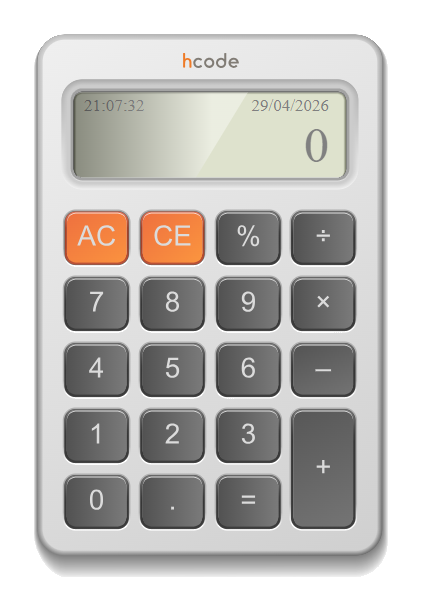

<<<<<<< HEAD
=======
# Calculadora JavaScript

](https://www.udemy.com/share/1013tY3@MsP1kqoqYnGJhZHsts7OQFHji-cD04CtbQNfk_u16UTHEY8yLzDc6S7K15PwT38kUg==/)

Calculadora desenvolvida como exemplo do Curso Completo de JavaScript na Udemy.com.

>>>>>>> parent of cae7d5b (Update README.md)
### Projeto

